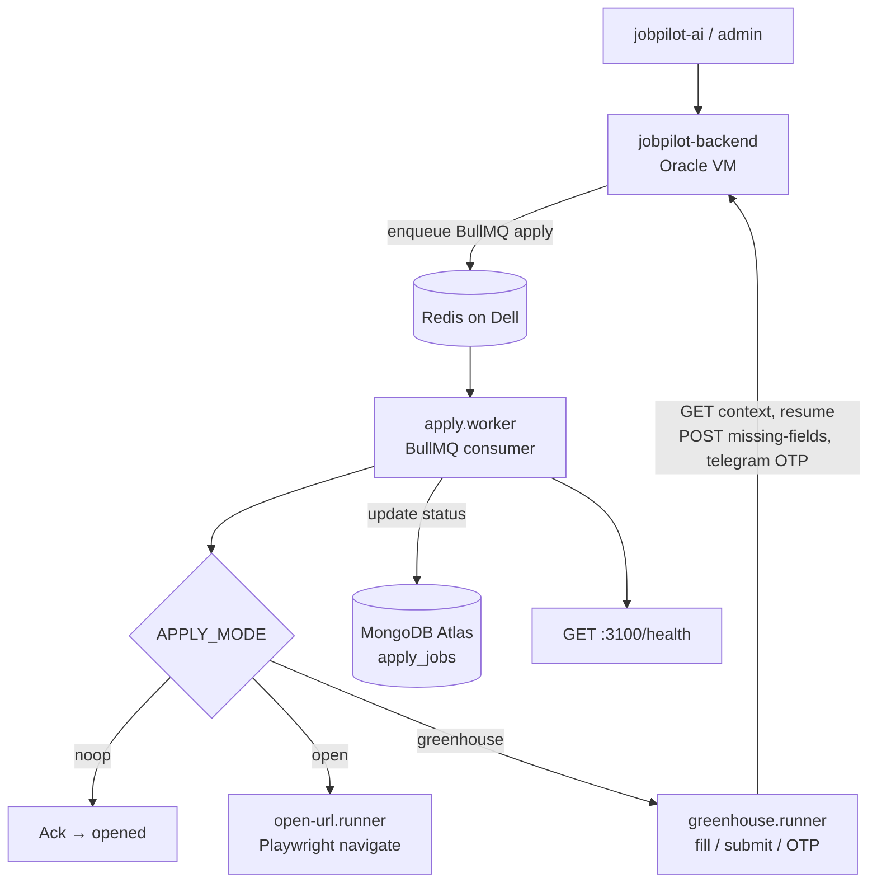

# jobpilot-apply-worker

Playwright auto-apply worker for JobPilot. Consumes BullMQ queue `apply` from Redis, opens employer apply URLs, and updates MongoDB `apply_jobs` status.

Runs on a **home Dell Linux (x86_64)** PC — not on the API host.

| Phase | Status |
|-------|--------|
| Phase 1 — scaffold + CI/CD | Done |
| Phase 2 — API enqueue on Accept | Done (shared Redis + `apply_jobs`) |
| Phase 3 — Playwright open URL | Done (`APPLY_MODE=open`) |
| Phase 4 — Greenhouse form fill | Done (`APPLY_MODE=greenhouse`, `APPLY_SUBMIT=false` default) |

**Repo:** https://github.com/chaitanya07422/jobpilot-apply-worker

Related: [jobpilot-backend](https://github.com/chaitanya07422/jobpilot-backend) · [Tailscale Redis](docs/TAILSCALE-REDIS.md) · [Dell setup](docs/DELL-SETUP.md)

---

## Architecture

This service is the **BullMQ consumer** for JobPilot auto-apply. The Nest API (**jobpilot-backend**) enqueues jobs; this worker runs on the Dell, drives Playwright against ATS pages, and writes status back to shared MongoDB. Telegram OTP handling stays on the API — the worker only calls internal HTTP endpoints.

### System diagram

```text
  jobpilot-ai / jobpilot-admin
              │
              ▼
┌─────────────────────────────┐         Tailscale
│  jobpilot-backend (Oracle)  │──────────────────────┐
│  POST /jobs/:id/accept      │                      │
│  → BullMQ enqueue "apply"   │                      ▼
│  Internal APIs:             │              ┌───────────────┐
│   context / resume / OTP    │◄─────────────│ Redis :6379   │
│   missing-fields            │  consume     │ (on Dell)     │
└──────────────┬──────────────┘              └───────▲───────┘
               │ HTTPS  X-Apply-Worker-Key           │
               │                                     │
               │         ┌───────────────────────────┘
               │         │
               ▼         ▼
┌──────────────────────────────────────────────────────┐
│  jobpilot-apply-worker (Dell Linux + PM2)            │
│                                                      │
│  index.ts                                            │
│    ├─ health server  :3100 /health                   │
│    └─ BullMQ Worker (queue: apply)                   │
│           │                                          │
│           ├─ APPLY_MODE=noop      → ack only         │
│           ├─ APPLY_MODE=open      → open-url runner  │
│           └─ APPLY_MODE=greenhouse                   │
│                 → greenhouse.runner (Playwright)     │
│                      ├─ fetch context + resume PDF   │
│                      ├─ fill Greenhouse embed form   │
│                      ├─ optional Submit              │
│                      └─ Telegram security-code wait  │
│                           (via backend internal API) │
│                                                      │
│  mongo.reporter → MongoDB Atlas apply_jobs           │
└──────────────────────────────────────────────────────┘
```



### Apply job lifecycle

```text
queued (API writes apply_jobs + enqueues)
   │
   ▼
running (worker picks job)
   │
   ├──▶ opened      — navigate / fill-only (APPLY_SUBMIT=false)
   ├──▶ applied     — Greenhouse submit succeeded
   ├──▶ needs_input — required fields missing (reported to API)
   └──▶ failed      — unexpected error (no BullMQ retry throw)
```

### Component map

| Path | Role |
|------|------|
| `src/index.ts` | Boot: Mongo → health server → BullMQ worker |
| `src/queue/apply.worker.ts` | Consume queue `apply`, route by `APPLY_MODE` |
| `src/runners/greenhouse.runner.ts` | Greenhouse fill, resume upload, submit, OTP |
| `src/runners/open-url.runner.ts` | Navigate-only fallback |
| `src/applicant/applicant-client.ts` | Backend HTTP (`X-Apply-Worker-Key`) |
| `src/telegram/security-code.ts` | Wait / retry OTP via backend |
| `src/status/mongo.reporter.ts` | Direct `apply_jobs` status writes |
| `src/health/server.ts` | `GET /health` |

### Boundary with the API

| Concern | Owner |
|---------|--------|
| Enqueue on Accept / retry | **Backend** |
| BullMQ consume + Playwright | **This worker** |
| Resume PDF + apply context | Backend internal API → worker |
| Telegram bot token + OTP relay | **Backend** (worker long-polls wait endpoint) |
| `apply_jobs` status | Worker writes Mongo directly (same Atlas DB) |
| ATS coverage today | **Greenhouse only**; other URLs use open-url |

### Topology note (Redis)

API and worker must share one Redis. Typical prod layout: Redis runs on the Dell; backend reaches it over Tailscale (`REDIS_HOST=<Dell Tailscale IP>`); worker uses `REDIS_HOST=127.0.0.1`. See [docs/TAILSCALE-REDIS.md](docs/TAILSCALE-REDIS.md).

---

## One-time setup on the Dell (`chaitu@192.168.1.15`)

From your Mac (same Wi‑Fi):

```bash
ssh chaitu@192.168.1.15
```

On the Dell:

```bash
# Node 20+
curl -fsSL https://deb.nodesource.com/setup_20.x | sudo -E bash -
sudo apt-get install -y nodejs git
sudo npm i -g pm2

# Clone
mkdir -p ~/apps && cd ~/apps
git clone https://github.com/chaitanya07422/jobpilot-apply-worker.git
cd jobpilot-apply-worker

cp .env.example .env
nano .env   # set REDIS_* (and MONGODB_URI when API is ready)

npm ci
npx playwright install --with-deps chromium

npm run build
pm2 start ecosystem.config.cjs
pm2 save
pm2 startup   # follow the printed command
```

Disable sleep/suspend on the Dell.

### `.env` on Dell only (never commit)

```bash
REDIS_HOST=...
REDIS_PORT=6379
REDIS_PASSWORD=
MONGODB_URI=
APPLY_QUEUE_NAME=apply
APPLY_MODE=noop
PLAYWRIGHT_HEADLESS=true
CONCURRENCY=1
HEALTH_HOST=0.0.0.0
HEALTH_PORT=3100
```

Health check (after deploy):

```bash
curl -s http://192.168.1.15:3100/health
# {"ok":true,"service":"jobpilot-apply-worker","queue":"apply","mode":"noop","worker":"ready","redis":"up"}
```

---

## CI/CD (same as Oracle backend)

Push to `main` → GitHub Actions lint/build → **SSH into Dell** → `git pull` + `npm ci` + build + `pm2 reload`.

### Important: GitHub cannot reach `192.168.1.15`

`192.168.1.15` is a **private LAN** address. GitHub’s runners are on the public internet, so `DELL_HOST` must be something they can reach:

1. **Router port-forward** TCP `22` (or another port) → `192.168.1.15:22`
2. **DuckDNS / dynamic DNS** hostname pointing at your home public IP
3. Set secret `DELL_HOST` to that hostname (e.g. `chaitu-dell.duckdns.org`), **not** `192.168.1.15`

Use key-only SSH (disable password login if you expose port 22).

### Dell identity (your machine)

| | LAN (Mac → Dell) | GitHub Actions → Dell |
|--|------------------|------------------------|
| User | `chaitu` | secret `DELL_USER` = `chaitu` |
| Host | `192.168.1.15` | secret `DELL_HOST` = **public** hostname (DuckDNS), **not** `192.168.1.15` |
| App dir | `/home/chaitu/apps/jobpilot-apply-worker` | secret `DELL_APP_DIR` = same path |

From Mac (same Wi‑Fi):

```bash
ssh chaitu@192.168.1.15
```

### GitHub secrets

Repo → **Settings → Secrets and variables → Actions → Secrets**:

| Secret | Value |
|--------|--------|
| `DELL_HOST` | DuckDNS / public IP (GitHub **cannot** use `192.168.1.15`) |
| `DELL_USER` | `chaitu` |
| `DELL_SSH_KEY` | Private key (full PEM). Public key in Dell `~/.ssh/authorized_keys` |
| `DELL_APP_DIR` | `/home/chaitu/apps/jobpilot-apply-worker` |
| `DELL_SSH_PORT` | Optional, default `22` (use forwarded port if different) |

Also create environment **`production`** (Settings → Environments) if the workflow requires it (same as backend).

### Create SSH key on Mac (for Actions)

```bash
ssh-keygen -t ed25519 -C "github-actions-dell" -f ~/.ssh/jobpilot_dell_deploy -N ""
ssh-copy-id -i ~/.ssh/jobpilot_dell_deploy.pub chaitu@192.168.1.15

# Paste PRIVATE key into GitHub secret DELL_SSH_KEY:
cat ~/.ssh/jobpilot_dell_deploy
```

Test from Mac:

```bash
ssh -i ~/.ssh/jobpilot_dell_deploy chaitu@192.168.1.15
```

After port-forward + DuckDNS, test from outside (or rely on Actions).

---

## Local run

```bash
cp .env.example .env
npm ci
npm run build
npm start
```

`APPLY_MODE=noop` — ack jobs only (Phase 1 default).  
`APPLY_MODE=open` — Playwright navigates to `applyUrl`.

---

## Queue payload (Phase 2 API)

```json
{
  "applyJobId": "mongoObjectId",
  "userId": "mongoObjectId",
  "jobId": "mongoObjectId",
  "applyUrl": "https://boards.greenhouse.io/...",
  "source": "greenhouse",
  "company": "Stripe",
  "role": "Backend Engineer"
}
```
